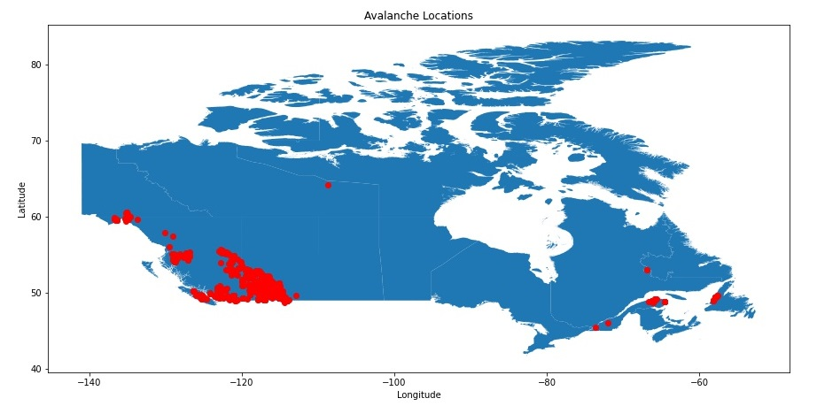
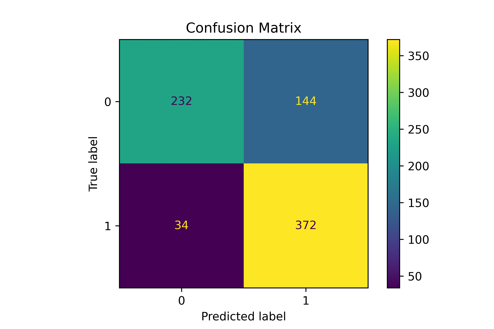

# Avalanche Prediction

## Introduction

---
According to the Canadian Government, ‘Thousands of avalanches occur in Canada each year. They happen in all regions of Canada but are more frequent in the mountains of British Columbia, Yukon and Alberta.’ Avalanches trigger due to a weak layer of snow that which when disrupted release the layers of snow above it allowing to move downhill. This problem is one that I am familiar with, as I have been asking my entire life. Due to being a part of the skiing community for so long and spending time in the backcountry where avalanches typically occur, I have completed my Avalanche Skills Training 1+ certificate and have a relatively good understanding of the mechanics behind avalanches

## The problem

---
Traditionally, if individuals were looking to go into avalanche territory, they would check the local avalanche forecast before going on the mountain and doing their field testing which can put them at risk. For most popular backcountry areas, avalanche forecasts are created by volunteers and subject matter experts daily during the months where winter backcountry activities happen. Manual insights lead to two problems, firstly regions that do not have experts monitoring them and putting out daily reports reduces the amount of information available to backcountry users. Secondly, creating accurate and reliable reports for various mountain regions describing avalanche risk is time-consuming.

## Summary

---
To help increase the amount of information and reduce the time required to make an avalanche forecast, I
have created a machine learning model that uses weather data to predict the occurrence of an avalanche. I
was able to get an accuracy of 76% using an SVC model after hyperparameter optimization and feature
engineering.

## Issues, Bias, and Assumptions

---

A significant issue with the quality of this model was the lack of reliability in the weather data. A considerable amount of weather stations had a lot of inconsistency in how much data they are reporting, resulting in a sizeable data loss. Trying to impute the data did not seem feasible as those changes in the weather could cause an avalanche; filling the values with anything but the correct data would affect the results. Another issue with the data that affects the real-world usefulness of the information is how the sub-samples of non-avalanche days got chosen. Since the subsample was taken from all the days, summer days are included in the subsample. Typically avalanches do not happen in the summer; therefore, this 2 could affect the model’s sensitivity because if the weather is hot, my model might predict there will not
be an avalanche which negates any pattern recognition of the model.

## Tools and Application ecosystem

---

The primary tool used for data transformation was python used inside a jupyter notebook. However, the
bulk download of weather data was done through Cygwin. Git-bash was used to set up and control the
environments used. Finally, version control was handled by Github through the VScode extension.

## Data Sources

---

### Avalanche Data

To acquire the location and time that an avalanche occurred, I utilized a web scraper for pulling data from
the Mountain Information Network (MIN) from Avalanche Canada. The web scraper was built using
selenium, a python library that can create automated browsers. After the web scraper selected the correct
date range and report type, it iterated through each available page, collecting all the URLs for the
avalanche reports. Next, the web scraper navigated to all the pages and collected the latitude, longitude,
and date.

As we can see from the map above, most of the avalanches (red dots) occurred in BC and Alberta. The
avalanche locations are consistent with the information that was gathered from the Canadian government
regarding avalanches. This similarity is good because it means our sample data is a good representation of
actual-world data.
3

### Weather Data

Using GeoPandas, I was able to cross-reference the location of the avalanches to a CSV of all the weather
stations the Canadian government tracks. After identifying all the stations, a list of their station IDs was
exported to a CSV. Then, using Cygwin, I created a bash script that did a bulk download of all the
weather data for the date range for each station in the CSV.

### Data Cleaning

Working with two independent data sets required a substantial amount of work to standardize the data.
One example of this is one dataset used + or - to signify direction for latitude and longitude and the other
data set used cardinal directions. Standardization was needed to join the data correctly and get the correct
weather data with its matching date of an avalanche.
The weather data also had missing data; some of the columns, such as ‘Total Snow (cm),’ also had an
associated flag column that signified a marginal amount of new snow fall. Columns like this had their
flags converted to integers so the models could use the information.

## Results

---

After a gridsearchCV on four
different models with 660 total fits, a
non-scaled SVM with an ‘RBF
kernel and a C=10 was found to be
the most accurate model at 76%. Of
the 24% my model got wrong, the
model typically reported false
negatives predicting an avalanche
when there was not one.
This result was consistent over
multiple runs after restarting the
kernel and rerunning the notebook.
However, the day before submitting this report, the model started to produce varying results with lower
overall scores. I am unsure what led to the spontaneous change, but I will assume the original SVC results
as the correct ones.

### Conclusion

---
At the beginning of this project, I naively thought I was playing it easy by building a simple model to
predict avalanches. However, that was not the case. This project forced me to do a deep dive into data
collection. I learned how to make a web scraping bot that was efficient and reliable, I also learned how to
4
do bulk data downloads from third-party sources. If I had been able to get better access to more accurate
weather information, I do not doubt that a more helpful model could have been produced. I believe using
machine learning, can benefit the backcountry community significantly by adding another tool to their
belt to help them accurately weigh the risks they are taking by going into avalanche areas. For the future
of this project, I plan to pivot to trying to look at mountain resorts that do avalanche checks. Hopefully,
these resorts collect the information of any avalanches, and I will be able to get more accurate information
about the mountain, like slope and sun exposure
